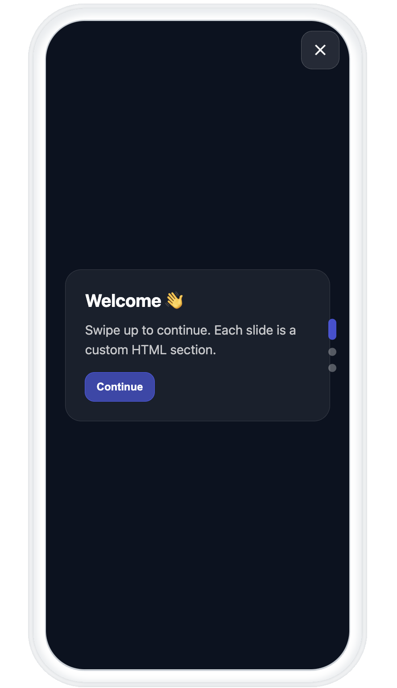

# Vertical Swiping Template

The Vertical Swiping template enables you to create an engaging multi-slide carousel experience. Users can swipe up/down or use navigation dots to browse through slides. Perfect for onboarding flows, feature highlights, or multi-step announcements.



## About This Template

This template uses touch/pointer events for smooth vertical swiping with:
- **Swipe gestures** - Natural up/down swiping with resistance at boundaries
- **Navigation dots** - Visual indicators and tap-to-navigate
- **Next/Back buttons** - In-card navigation controls
- **Safe area support** - Proper handling of notches and system bars

### Customization

Add or modify slides by editing the `.slide` sections in the HTML:

```html
<section class="slide">
  <div class="card">
    <h2>Your Title</h2>
    <p>Your content here.</p>
    <div class="actions">
      <button class="primary" type="button" data-next>Continue</button>
      <button type="button" data-prev>Back</button>
    </div>
  </div>
</section>
```

Use `data-next` and `data-prev` attributes on buttons to control navigation.


